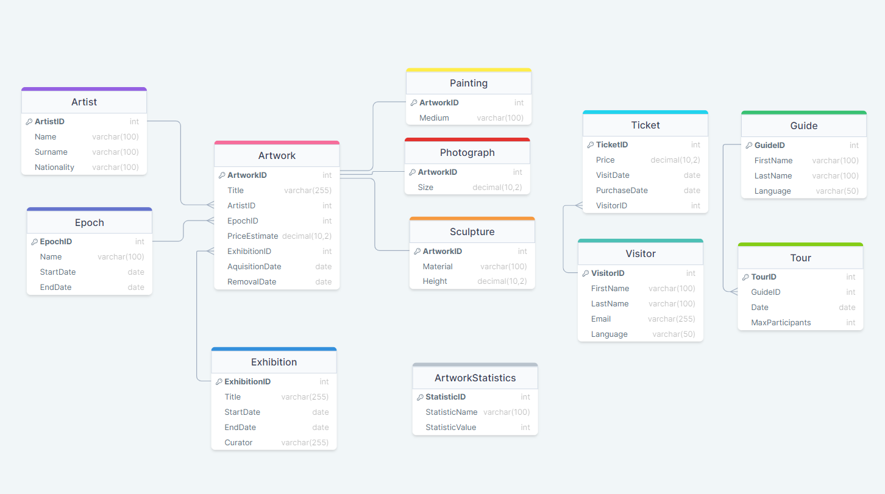

# Museum DBMS

A database project for a museum designed to facilitate the management of its operations related to exhibitions, artworks, visitors, and staff.
Thanks to such an organized database, the museum will be able to manage its resources effectively and conduct analyses concerning individual exhibits and exhibitions, contributing to better planning of future projects and events.

### Key components
- the tables used are visible in the [ER diagram](ER_diagram_DrawSQL.png)
- the creation of the database is presented in the [script](sript.sql); key parts are described in this README file
- to enable testing and demonstration of database functionalities, a [test data set](test_input.sql) has been prepared

## ER Diagram



## Views

Defined for data sets that might be frequently queried.
The first one displays tour details, sorted by the languages of the guides.

```sql
CREATE VIEW ToursByLanguage AS
SELECT t.TourID, t.Date, g.Language, g.GuideID, g.LastName AS "Guide LastName",
    DENSE_RANK() OVER (ORDER BY g.Language) LanguageRank
FROM Tour t
JOIN Guide g ON t.GuideID = g.GuideID;
```

In subsequent views, there are details of the artworks, sorted by the [from the earliest to the latest] epoch, and price. Thanks to ranking functions, we can easily identify in which (chronologically) epoch and which in the price ranking an artwork is.

```sql
CREATE VIEW ArtworksByEpoch AS
SELECT a.ArtworkID, a.Title, e.Name AS EpochName, e.StartDate,
    DENSE_RANK() OVER (ORDER BY e.StartDate) AS EpochOrder
FROM Artwork a
JOIN Epoch e ON e.EpochID = a.EpochID;
```

```sql
CREATE VIEW ArtworksByEstimatedPrice AS
SELECT a.ArtworkID, a.Title, a.PriceEstimate, 
	RANK() OVER (ORDER BY a.PriceEstimate DESC) AS PriceRank
FROM Artwork a;
```

These views use the `GETDATE()` and `DATEDIFF()` functions to display data in relation to time.

```sql
CREATE VIEW UpcomingExhibitions AS
SELECT ExhibitionID, Title, StartDate, EndDate,
       DATEDIFF(day, StartDate, EndDate) AS DurationDays
FROM Exhibition
WHERE EndDate > GETDATE();
```

```sql
CREATE VIEW PastTours AS
SELECT TourID, GuideID, Date, MaxParticipants 
FROM Tour
WHERE Date < GETDATE();
```

The view provides selected details from three tables:

```sql
CREATE VIEW ArtworkDetails AS
SELECT a.ArtworkID, a.Title, ar.FirstName, ar.LastName, e.Name "Epoch name"
FROM Artwork a
JOIN Artist ar ON a.ArtistID = ar.ArtistID
JOIN Epoch e ON a.EpochID = e.EpochID;
```

The simplest use of these views:

```sql
SELECT * FROM UpcomingExhibitions;
```

# Functions

They serve to quickly find data depending on specific parameters, such as the ID of a visitor or the date on which the artwork is to be available.
The following function returns a table with tours in the language of the given visitor, on days when they have purchased tickets.

```sql
CREATE FUNCTION offer_tour (@VisitorID INT)
RETURNS TABLE
AS
RETURN
(
    SELECT t.TourID, t.Date, g.Language
    FROM Ticket tk
    JOIN Visitor v ON tk.VisitorID = v.VisitorID
    JOIN Guide g ON v.Language = g.Language
    JOIN Tour t ON t.GuideID = g.GuideID AND tk.VisitDate = t.Date
    WHERE tk.VisitorID = @VisitorID AND t.Date > GETDATE()
);
```

Function call - with exemplary data - Diane Miller can be offered a tour in English on 2024-07-20.

```sql
SELECT * FROM dbo.offer_tour(4); 
```

Subsequent functions have different return types. 


```sql
CREATE FUNCTION check_artwork_availability(@ArtworkID INT, @RequiredDate DATE)
RETURNS BIT
AS
BEGIN
    DECLARE @IsAvailable BIT;
    SELECT @IsAvailable = CASE 
        WHEN RemovalDate IS NULL OR RemovalDate > @RequiredDate THEN 1
        ELSE 0
    END
    FROM Artwork
    WHERE ArtworkID = @ArtworkID;
    RETURN @IsAvailable;
END;
```

```sql
CREATE FUNCTION count_artworks_in_epoch(@EpochID INT)
RETURNS INT
AS
BEGIN
    DECLARE @ArtworkCount INT;
    SELECT @ArtworkCount = COUNT(*)
    FROM Artwork
    WHERE EpochID = @EpochID;
    RETURN @ArtworkCount;
END;
```

```sql
CREATE FUNCTION estimate_exhibition_value(@ExhibitionID INT)
RETURNS DECIMAL(38, 2)
AS
BEGIN
    DECLARE @TotalValue DECIMAL(38, 2);

    SELECT @TotalValue = SUM(PriceEstimate)
    FROM Artwork
    WHERE EpochID = (SELECT EpochID FROM Exhibition WHERE ExhibitionID = @ExhibitionID);

    RETURN @TotalValue;
END;
```

Function calls:

```sql
DECLARE @ArtworkAvailabe BIT;
SET @ArtworkAvailabe = dbo.check_artwork_availability(1, '2024-03-27'); -- "Starry Night Over The Rhone" is avalable on this day
SELECT @ArtworkAvailabe;

DECLARE @ArtworksInEpoch INT;
SET @ArtworksInEpoch = dbo.count_artworks_in_epoch(1); -- ID=1: impressionism
SELECT @ArtworksInEpoch;

DECLARE @EstimatedValue DECIMAL(38,2);
SET @EstimatedValue = dbo.estimate_exhibition_value(3); -- 259315000.00 ('Renaissance Highlights')
SELECT @EstimatedValue;
```

## Stored procedures

Defined procedures relate to the most frequent changes - adding a new artwork, purchasing a ticket, registering a new visitor, planning and canceling tours.

```sql
CREATE PROC add_new_artwork 
@Title NVARCHAR(255), 
@ArtistID INT,
@EpochID INT,
@PriceEstimate DECIMAL(10, 2),
@ExhibitionID INT,
@RemovalDate DATE
AS
BEGIN
    INSERT INTO Artwork (Title, ArtistID, EpochID, PriceEstimate, ExhibitionID, AcquisitionDate, RemovalDate)
    VALUES (@Title, @ArtistID, @EpochID, @PriceEstimate, @ExhibitionID, GETDATE(), @RemovalDate);
END;
```

```sql
CREATE PROC purchase_ticket 
@Price DECIMAL(10, 2), 
@VisitDate DATE,
@VisitorID INT
AS
BEGIN
    INSERT INTO Ticket (Price, VisitDate, PurchaseDate, VisitorID)
    VALUES (@Price, @VisitDate, GETDATE(), @VisitorID);
END;
```

```sql
CREATE PROC register_new_visitor 
@FirstName NVARCHAR(100), 
@LastName NVARCHAR(100), 
@Email NVARCHAR(255), 
@Language NVARCHAR(50)
AS
BEGIN
    INSERT INTO Visitor (FirstName, LastName, Email, Language)
    VALUES (@FirstName, @LastName, @Email, @Language);
END;
```

```sql
CREATE PROC schedule_tour 
@GuideID INT, 
@Date DATE, 
@MaxParticipants INT
AS
BEGIN
    INSERT INTO Tour (GuideID, Date, MaxParticipants)
    VALUES (@GuideID, @Date, @MaxParticipants);
END;
```

```sql
CREATE PROC cancel_tour 
@TourID INT
AS
BEGIN
    DELETE FROM Tour
    WHERE TourID = @TourID;
END;
```

## Triggers

Triggers in this database serve to update statistics in the ArtworkStatistics table.
This happens whenever rows are added or removed in the tables on which the triggers are defined (Painting, Sculpture, Photograph, Ticket, Exhibition).

```sql
CREATE TRIGGER update_paintings_count 
ON Painting
AFTER INSERT, DELETE
AS
BEGIN
    DECLARE @CurrentCount INT;
    SELECT @CurrentCount = COUNT(*) FROM Painting;

    UPDATE ArtworkStatistics
    SET StatisticValue = @CurrentCount
    WHERE StatisticName = 'PaintingsCount';
END;
```
The triggers `update_sculptures_count` and `update_photograph_count` share this logic.

```sql
CREATE TRIGGER update_exhibition_stats
ON Exhibition
AFTER INSERT, UPDATE, DELETE
AS
BEGIN
    DECLARE @CurrentExhibitions INT;
    SELECT @CurrentExhibitions = COUNT(*)
    FROM Exhibition
    WHERE EndDate >= GETDATE();

    UPDATE ArtworkStatistics
    SET StatisticValue = @CurrentExhibitions
    WHERE StatisticName = 'CurrentExhibitions';
END;
```
Another trigger `update_active_visitors` shares this logic as well.

The correct operation of triggers can be checked by displaying the ArtworkStatistics table, which should reflect the numbers of paintings, sculptures, photographs, active visitors, and current exhibitions.

```sql
SELECT * FROM ArtworkStatistics;
```
