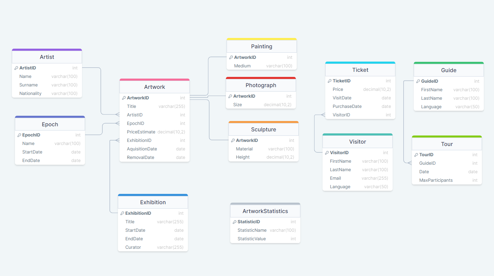

# Baza Danych Muzeum - BD 23/24

Celem projektu jest opracowanie bazy danych dla muzeum, mającej ułatwić zarządzanie jego działalnością. Projekt koncentruje się na optymalizacji procesów związanych z wystawami, dziełami sztuki, odwiedzającymi i personelem.


### Tabele

Kluczowymi elementami projektu są tabele przechowujące dane dotyczące artystów, epok, wystaw  dzieł sztuki wraz z ich kategoriami takimi jak malarstwo, fotografie, rzeźby, a także informacje o biletach, odwiedzających, statystykach, przewodnikach oraz wycieczkach. 

Dzięki tak zorganizowanej bazie, muzeum będzie mogło nie tylko efektywnie zarządzać swoimi zasobami, ale również prowadzić analizy dotyczące poszczególnych eksponatów czy wystaw, co może przyczynić się do lepszego planowania przyszłych projektów i wydarzeń.

Tworzenie bazy danych i tabel, włącznie z dodatkowymi więzami integralności jest zaprezentowane w [skrypcie](script.sql). W celu umożliwienia testowania i demonstracji funkcjonalności bazy danych, przygotowany został [zestaw danych testowych](test_input.sql), objemujący przykładowe rekordy dla każdej z tabel.


### Pielęgnacja Bazy Danych

Aby nie utracić danych dotyczących muzeum, należy tworzyć różnicową kopię zapasową każdej nocy, poza godzinami pracy muzeum, oraz pełnej kopii zapasowej co tydzień. 

# Diagram ER



# Widoki

Są zdefiniowane dla zestawów danych, które mogłyby być często kwerendowane.

Pierwszy wyświetla szczegóły wycieczek, posortowane według języków przewodników.

```sql
CREATE VIEW ToursByLanguage AS
SELECT t.TourID, t.Date, g.Language, g.GuideID, g.LastName AS "Guide LastName",
    DENSE_RANK() OVER (ORDER BY g.Language) LanguageRank
FROM Tour t
JOIN Guide g ON t.GuideID = g.GuideID;
```

W kolejnych widokach mamy szczegóły dotyczące dzieł, które są wyświetlane kolejno od najwcześniej do najpóźniejszej epoki, oraz od najdroższego do najtańszego. Dzięki funkcjom rankingowym możemy łatwo zidentyfikować, w której (chronologicznie) epoce oraz które w rankingu ceny jest dane dzieło.

```sql
CREATE VIEW ArtworksByEpoch AS
SELECT a.ArtworkID, a.Title, e.Name AS EpochName, e.StartDate,
    DENSE_RANK() OVER (ORDER BY e.StartDate) AS EpochOrder
FROM Artwork a
JOIN Epoch e ON e.EpochID = a.EpochID;
```

```sql
CREATE VIEW ArtworksByEstimatedPrice AS
SELECT a.ArtworkID, a.Title, a.PriceEstimate, 
	RANK() OVER (ORDER BY a.PriceEstimate DESC) AS PriceRank
FROM Artwork a;
```

Te widoki wykorzystują funkcje `GETDATE()` oraz `DATEDIFF()`, aby wyświetlić dane odnoszące się do przeszłości i przyszłości.

```sql
CREATE VIEW UpcomingExhibitions AS
SELECT ExhibitionID, Title, StartDate, EndDate,
       DATEDIFF(day, StartDate, EndDate) AS DurationDays
FROM Exhibition
WHERE EndDate > GETDATE();
```

```sql
CREATE VIEW PastTours AS
SELECT TourID, GuideID, Date, MaxParticipants 
FROM Tour
WHERE Date < GETDATE();
```

Widok dostarcza wybranych szczegółów z trzech tabel:

```sql
CREATE VIEW ArtworkDetails AS
SELECT a.ArtworkID, a.Title, ar.FirstName, ar.LastName, e.Name "Epoch name"
FROM Artwork a
JOIN Artist ar ON a.ArtistID = ar.ArtistID
JOIN Epoch e ON a.EpochID = e.EpochID;
```

Najprostsze wykorzystanie tych widoków:

```sql
SELECT * FROM UpcomingExhibitions;
```

# Funkcje

Służą do szybkiego wyszukania danych zależnych od konkretnych parametrów, takich jak ID odwiedzającego, czy data, w której dzieło ma być dostępne.

Poniższa funkcja zwraca tabelę z wycieczkami w języku danego odwiedzającego, w dniach, w które ma zakupione bilety.

```sql
CREATE FUNCTION offer_tour (@VisitorID INT)
RETURNS TABLE
AS
RETURN
(
    SELECT t.TourID, t.Date, g.Language
    FROM Ticket tk
    JOIN Visitor v ON tk.VisitorID = v.VisitorID
    JOIN Guide g ON v.Language = g.Language
    JOIN Tour t ON t.GuideID = g.GuideID AND tk.VisitDate = t.Date
    WHERE tk.VisitorID = @VisitorID AND t.Date > GETDATE()
);
```

Wywołanie funkcji - z przykładownymi danymi - Dianie Miller można zaproponować wycieczkę po angielsku w dniu 2024-07-20. 

```sql
SELECT * FROM dbo.offer_tour(4); 
```

Kolejne funkcje zwracają wartości, kolejno:

dostępność danego dzieła w danym dniu (1/0)

```sql
CREATE FUNCTION check_artwork_availability(@ArtworkID INT, @RequiredDate DATE)
RETURNS BIT
AS
BEGIN
    DECLARE @IsAvailable BIT;
    SELECT @IsAvailable = CASE 
        WHEN RemovalDate IS NULL OR RemovalDate > @RequiredDate THEN 1
        ELSE 0
    END
    FROM Artwork
    WHERE ArtworkID = @ArtworkID;
    RETURN @IsAvailable;
END;
```

liczbę dzieł w danej epoce

```sql
CREATE FUNCTION count_artworks_in_epoch(@EpochID INT)
RETURNS INT
AS
BEGIN
    DECLARE @ArtworkCount INT;
    SELECT @ArtworkCount = COUNT(*)
    FROM Artwork
    WHERE EpochID = @EpochID;
    RETURN @ArtworkCount;
END;
```

szacowaną wartość wystawy

```sql
CREATE FUNCTION estimate_exhibition_value(@ExhibitionID INT)
RETURNS DECIMAL(38, 2)
AS
BEGIN
    DECLARE @TotalValue DECIMAL(38, 2);

    SELECT @TotalValue = SUM(PriceEstimate)
    FROM Artwork
    WHERE EpochID = (SELECT EpochID FROM Exhibition WHERE ExhibitionID = @ExhibitionID);

    RETURN @TotalValue;
END;
```

Wywołanie funkcji:

```sql
DECLARE @ArtworkAvailabe BIT;
SET @ArtworkAvailabe = dbo.check_artwork_availability(1, '2024-03-27'); -- "Starry Night Over The Rhone" jest dostępne w tym dniu
SELECT @ArtworkAvailabe;

DECLARE @ArtworksInEpoch INT;
SET @ArtworksInEpoch = dbo.count_artworks_in_epoch(1); -- ID=1: impresjonizm
SELECT @ArtworksInEpoch;

DECLARE @EstimatedValue DECIMAL(38,2);
SET @EstimatedValue = dbo.estimate_exhibition_value(3); -- 259315000.00 ('Renaissance Highlights')
SELECT @EstimatedValue;
```

# Procedury składowane

Zdefiniowane procedury odnoszą się do najczęściej dokonywanych zmian - dodania nowego dzieła, zakupu biletu, zarejestrowania nowego odwiedzającego, planowania oraz odwoływania wycieczek.

```sql
CREATE PROC add_new_artwork 
@Title NVARCHAR(255), 
@ArtistID INT,
@EpochID INT,
@PriceEstimate DECIMAL(10, 2),
@ExhibitionID INT,
@RemovalDate DATE
AS
BEGIN
    INSERT INTO Artwork (Title, ArtistID, EpochID, PriceEstimate, ExhibitionID, AcquisitionDate, RemovalDate)
    VALUES (@Title, @ArtistID, @EpochID, @PriceEstimate, @ExhibitionID, GETDATE(), @RemovalDate);
END;
```

```sql
CREATE PROC purchase_ticket 
@Price DECIMAL(10, 2), 
@VisitDate DATE,
@VisitorID INT
AS
BEGIN
    INSERT INTO Ticket (Price, VisitDate, PurchaseDate, VisitorID)
    VALUES (@Price, @VisitDate, GETDATE(), @VisitorID);
END;
```

```sql
CREATE PROC register_new_visitor 
@FirstName NVARCHAR(100), 
@LastName NVARCHAR(100), 
@Email NVARCHAR(255), 
@Language NVARCHAR(50)
AS
BEGIN
    INSERT INTO Visitor (FirstName, LastName, Email, Language)
    VALUES (@FirstName, @LastName, @Email, @Language);
END;
```

```sql
CREATE PROC schedule_tour 
@GuideID INT, 
@Date DATE, 
@MaxParticipants INT
AS
BEGIN
    INSERT INTO Tour (GuideID, Date, MaxParticipants)
    VALUES (@GuideID, @Date, @MaxParticipants);
END;
```

```sql
CREATE PROC cancel_tour 
@TourID INT
AS
BEGIN
    DELETE FROM Tour
    WHERE TourID = @TourID;
END;
```

# Wyzwalacze

Wyzwalacze w tej bazie służą do aktualizowania statystyk dotyczących typów dzieł, aktywnych odwiedzających i aktualnych wystaw w tabeli ArtworkStatistics. 

Dzieje się to zawsze, gdy zostaną dodane lub usunięte wiersze w odpowiednich tabelach, na których zdefiniowane są wyzwalacze. 

```sql
CREATE TRIGGER update_paintings_count
ON Painting
AFTER INSERT, DELETE
AS
BEGIN
    DECLARE @CurrentCount INT;
    SELECT @CurrentCount = COUNT(*) FROM Painting;

    UPDATE ArtworkStatistics
    SET StatisticValue = @CurrentCount
    WHERE StatisticName = 'PaintingsCount';
END;
```

```sql
CREATE TRIGGER update_sculptures_count
ON Sculpture
AFTER INSERT, DELETE
AS
BEGIN
    DECLARE @CurrentCount INT;
    SELECT @CurrentCount = COUNT(*) FROM Sculpture;

    UPDATE ArtworkStatistics
    SET StatisticValue = @CurrentCount
    WHERE StatisticName = 'SculpturesCount';
END;
```

```sql
CREATE TRIGGER update_photograph_count
ON Photograph
AFTER INSERT, DELETE
AS
BEGIN
    DECLARE @CurrentCount INT;
    SELECT @CurrentCount = COUNT(*) FROM Photograph;

    UPDATE ArtworkStatistics
    SET StatisticValue = @CurrentCount
    WHERE StatisticName = 'PhotographCount';
END;
```

```sql
CREATE TRIGGER update_active_visitors
ON Ticket
AFTER INSERT, DELETE
AS
BEGIN
    DECLARE @ActiveVisitors INT;
    SELECT @ActiveVisitors = COUNT(DISTINCT VisitorID)
    FROM Ticket
    WHERE VisitDate >= GETDATE();

    UPDATE ArtworkStatistics
    SET StatisticValue = @ActiveVisitors
    WHERE StatisticName = 'ActiveVisitors';
END;
```

```sql
CREATE TRIGGER update_exhibition_stats
ON Exhibition
AFTER INSERT, UPDATE, DELETE
AS
BEGIN
    DECLARE @CurrentExhibitions INT;
    SELECT @CurrentExhibitions = COUNT(*)
    FROM Exhibition
    WHERE EndDate >= GETDATE();

    UPDATE ArtworkStatistics
    SET StatisticValue = @CurrentExhibitions
    WHERE StatisticName = 'CurrentExhibitions';
END;
```

Poprawne działanie wyzwalaczy można sprawdzić poprzez wyświetlenie tabeli ArtworkStatistics, która powinna odzwierciedlać liczby obrazów, rzeźb, fotografii, aktywnych odwiedzających oraz aktualnych wystaw.

```sql
SELECT * FROM ArtworkStatistics;
```
